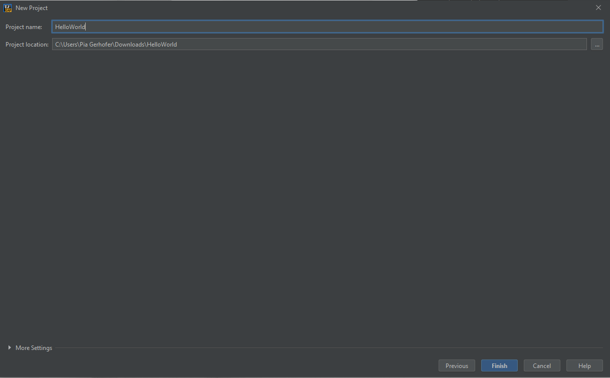
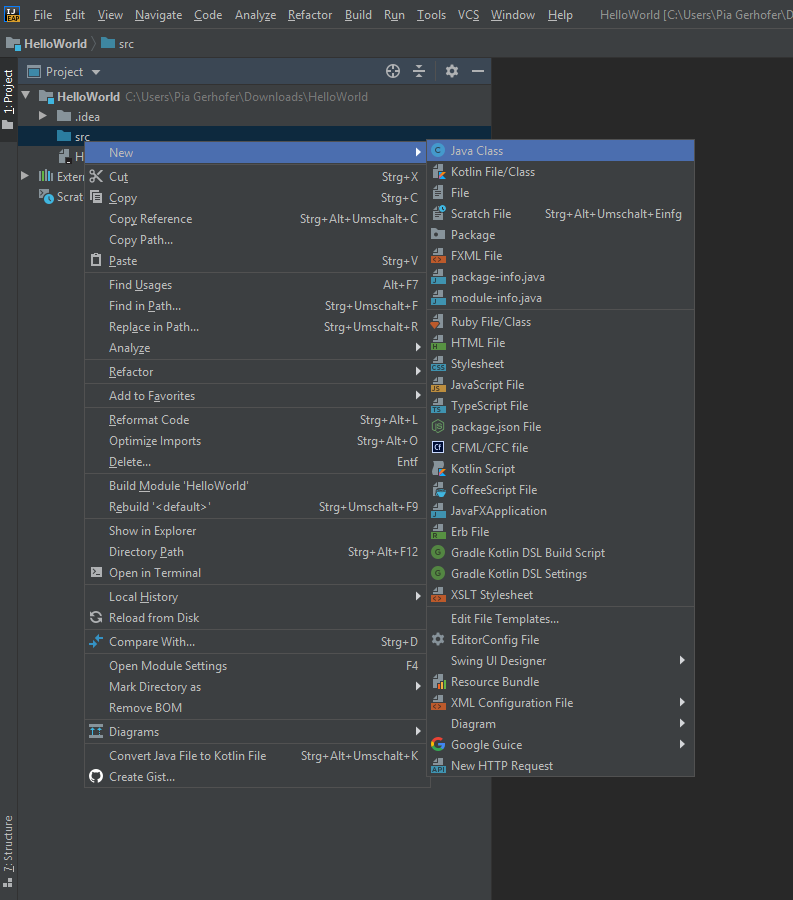

# Java Exercise 1

## Installing IntelliJ IDEA

An IDE (integrated development environment) is a powerful tool for development. As a first step we will install IntelliJ one of the most popular IDEs for Java development.

There is a really nice [Video](https://www.linkedin.com/learning/intellij-idea-community-edition-essential-training/welcome?u=68130610 "Get started with IntelliJ") explaining how to set up IntelliJ and create your first project.

Download Links: 

* [IntelliJ Community Edition](https://www.jetbrains.com/idea/download/#section=windows)
* [JDK (Java Development Kit)](https://www.oracle.com/technetwork/java/javase/downloads/jdk11-downloads-5066655.html)

Take care to choose the right download for your environment (macOs, Windows, Linux).

## Creating your first Project

To create a new Project, open IntelliJ and click `Create New Project`. Choose `Java` in the dialog that opened, click next and give the project a name. A usual name for the first project is `HelloWorld`. 




IntelliJ will create an empty project for you, when you click Ok. Next you have to add a file to write our code in. To create a class you have to right-click on the src directory. A new menu should appear, select the `New` line and select `Java Class`.



The class can be named however you like, but for a start we will call it HelloWorld. The class containing the `main method` is usually called like the project itself. In Java it's convention to name classes and files the same and use CamelCase names. CamelCase means words are concatinated without any extra signs and start with a capital letter.

Our first Program will just print the text `Hello World` to the console.

```java 
public class HelloWorld {

    public static void main(String[] args) {
        System.out.println("Hello World");
    }

}
```

### The main method:
A method is a block of code that can be called and executed with given parameters.
Every program needs a place to start its execution; talking about Java programs, the main entry point is the main method.

A green play icon should appear next to the main class, you can click that to execute the program. If not you can also use the buttons on the top right to start the program. 


When you run the program you should see the `Hello World` line in the console. Voilá you wrote your first Java program!
Let's take a closer look at the code we just wrote.
* public: the access modifier, specifies from where the method can be accessed
* static: specifies weather an instance of an object is needed to access the method or weather it can be exectuded on class level
* void: the methods return type, Void specifies that the method has no return value
* main: the methods name
* String[ ] args: parameter
* `System.out.println` is a Java statement that prints the argument passed to the Console.

More to acces modifiers, static and return types later. 

We can use comments to make some notes for ourself by using two slashes like the following: 

```java
public class HelloWorld {

    public static void main(String[] args) {
        // This is a comment. Hello world will be printed to the console
        System.out.println("Hello World");
    }

}
```

Hint: When you type `sout` and hit the tab key it will autocomplete to `System.out.println` to save you some time typing.

## Variables 

A variable is a container in which you can store a value. There are different data types to store different kinds of things like numbers, words or letters. 

### Datatypes

A Boolean value is used to represent a conditions or logical values. It has two possible values - true or false.

There are various types to represent numerical values:
An Integer is a representation for whole numbers. The maximum value is 2147483647 and the minimum is -2147483648. A Long can be used for numbers out of this range.
Floating point numbers can be represented as a Double or Float.

A char is needed when you want to store just one character. They are indicated with single quotes, e.g.: ‘a’, ‘b’, ‘?’, ‘3’

A String is an object that represents a sequence of characters. They are indicated with double quotes, e.g: “Hello World”, “Maria”, “Max”

When we declare a variable we first specify the type of the variable, then the name of the variable. If we also want to assign a value to the variable we can use the assignment operator `=` and specify a value on the right handside of the assignment.

Let's declare some variables in our main method:

```java
boolean hungry = true;
int age = 20;
double height = 1.60;
char firstLetter = 'a';
String name = "Anna";
```

 Per Java naming conventions variables should start with a small letter and be CamelCase. Every command in Java must be ended with a semicolon `;`!

 When we run the project, five variables will be created - but we won’t see any change in our output, because we didn’t do anything with the variables. In order to see something working we will just print the variables to the console using `System.out.println`. 

You can concatenate variables and text with the `+` operator. 
For a start, we will just print some of our variables.

```java
boolean hungry = true;
int age = 20;
String name = "Anna";
System.out.print("Are you hungry? " + hungry);
System.out.print("What is your name and how old are you? I am " + age + "years old and my name is " +name + ".");
```

When we run this project we can see some output in our console, when we change the values of our variables and run the program again the output will resemble our changes. 

The datatype of a variable must only be specified on the firs usage, on the creation of the variable. If we want to change the type afterwards we have to use a syntax that is a little different

```java
int age = 20;
System.out.println(“I am “ + age + “ years old);
System.out.println(“Another year passed… “);
age = 21;
System.out.println(“I am “ + age + “ years old);
```

The variable age is overwritten and we changed the value it stores.

## Operators

First of all let's declare two numbers, number1 and number2 with 34 and 87 and print them to the console.

```java
int number1 = 34;
int number2 = 87;

System.out.println("Number 1 is " + number1);
System.out.println("Number 2 is " + number2);
```

In Java, there are different operators for mathematical operations. Let’s first calculate the sum of our two declared numbers and print the result to the console.

```java
int number1 = 34;
int number2 = 87;

System.out.println(number2 + number1);
```

Now the output should be 121. We can try other mathematical operators as well to multiply, subtract or divide numbers.
Instead of just printing the result of the calculation to the console, we could also store the result in a variable.

```java
int number1 = 34;
int number2 = 87;
int sum = number2 + number1;
System.out.println("The sum of " + number1 + " and " + number2 + " is " + sum);
```

When we take our age example again from before we have multiple ways to express that the age variable increased by one. 

```java
int age = 24;
System.out.println(age);
age = age + 1;
System.out.println(age);
age += 1;
System.out.println(age);
age ++;
System.out.println(age);
```

When we execute this code it will print 24, 25, 26 and 27. `age = age + 1` can be written in a short way by `age += 1` and can be used to increase any variable by any number (not just 1). The `age++` is a shorter way to say increase by one. 

The operators work as expected for all numerical data types (int, double, long) - But we can also use operators to perform operations on Strings! That's actually what we have used already in our `System.out.println` statements.

```java
int number1 = 34;
int number2 = 87;
String notANumber = "100";

System.out.println(notANumber + number1);
System.out.println(number1 + notANumber);
```

When we execute this code it will print 10034 and 87100. This only works because the Integers can be converted to Strings - therefore they are concatenated and not added. 

Play around and see which calculations with numbers and strings work!

### Logical Operators

For comparing there are some operators as well. The result of comparing two values always is a Boolean value, true or false.
To compare
* If two values are the same 🡪 ==
* If two values are not the same 🡪 !=
* If one value is greater or less than the other one 🡪 > or <
* If one value is greater or equal or less or equal 🡪 >= or <=

We’ll need this in the next exercise.

```java 
int a = 10;
int b = 15;
boolean c;
c = a==b;
System.out.println(c)
c = a!=b;
System.out.println(c)
c = a<b;
System.out.println(c)
```

Play around again and see which things are equal and which are not. You can also use the comparisions for non-numeric data types.

## Control structures: if, else and switch

### If-statements

Control structures are helpful, if you want logic only to be executed under certain conditions. For things like that we can use if-statements in Java.
The syntax looks like the following:

```java
if (condition) {
	//statements to be executed when condition is true
}
```

A condition must be a boolean value, for example the result of a comparison.

An easy example could be a simple validation of integers. Let's create a variable, give it any name we want and assign it the value 0. 
The next step is writing an if and comparing weather the number is smaller or equal to 0. If it is, print to the console, that the value has to be bigger than 0.

```java
int age = 0;
if (age <= 0) {
    System.out.println("Your age must be more than zero");
}
```

Now if we also want to do something in case our age is more than zero we can use an else block. 

```java
int age = 0;
if (age <= 0) {
    System.out.println("Your age must be more than zero");
} else {
    System.out.println("All good, your age is greater than zero");
}
```

You can combine if's and elses in a statement: 

```java 
int age = 0;
if (age <= 0) {
    System.out.println("Your age must be more than zero");
} else if (age == 21) {
    System.out.println("21 is a really special age!");
} else {
    System.out.println("All good, your age is greater than zero");
}
```

If you want to join multiple conditions in one statement you can use the logical `and &&` and `or ||`. 

```java 
int number = 0;
if (age < 0) {
    System.out.println("Your number is less than zero!");
} else if (age == 1 || age == 2 || age == 3 | age == 5 || age == 7 || age == 11) {
    System.out.println("Your number is a prime!");
} else {
    System.out.println("All good, your age is greater than zero");
}
```

In this example, if the number is less than zeroe we'll see `Your number is less than zero!`, if the number is 1,2,3,5,7 or 11 we'll get `Your number is a prime!` and in every other case we will see `All good, your age is greater than zero`. 


### Switch

Another way of expressing conditional statements is the switch statement. The switch statement is escpecially handy when we have a finite set of possible variables. A nice example is an encoding of the possible days in a week - a 0 is monday, 1 is tuesday and so forth. The switch accepts a parameter and will compare this parameter to the available values in the case. The `default` branch represents the else. 

```java 
int dayOfTheWeek = 0;
switch (dayOfTheWeek) {
    case 0: System.out.println("Monday");
            break;
    case 1: System.out.println("Tuesday");
            break;
    case 2: System.out.println("Wednesday");
            break;
    case 3: System.out.println("Thursday");
            break;
    case 4: System.out.println("Friday");
            break;
    case 5: System.out.println("Saturday");
            break;
    case 6: System.out.println("Sunday");
            break;
    default: System.out.println("Invalid Weekday");
            break;
} 
```

Careful with the `break` statements. They are required to stop the execution of the switch-statement after a successful match. If we would not have the breaks we would see the line `Invalid Weekday` everytime after the specific weekday was matched. 

So if it were Monday and the break was not there our output would be: 
```
Monday
Invalid Weekday
```

| If            | Switch           | 
| ------------- |:-------------:| 
| allows complex expressions in the condition while switch wants a constant  | It only makes sense when the cases are finite | 
| accepts anything that evaluates to a boolean value      | only works with some types - int, long, String, enumerations    |  
| can't forget the break keyword |only constants for cases |   
| | very readable and compackt |


## Loops

There are three different kinds of loops in java. 

### While 

Let’s start with the while loop. The while loop executes the instructions given inside the loop body as long as a condition is fulfilled. 
The syntax is: 

```java
while (condition) {
	// instructions
}
```

Let’s initialize the variable i with 0. 
Create a while loop with the condition that i must not be bigger than 10. Print i in the loop.

```java
int i = 0;
while (i<10) {
	System.out.println(i);
}
```

When we do this we end up with an infinite loop printling lines of `1` because our loop condition never changes as our variable i never changes. 

> Insanity is doing the same thing over and over again and expecting different results

In our case it's checking again and again if i is less than 10 without i ever changing. Let's change that to increase i every time we pass the loop. 

```java
int i = 0;
while (i<10) {
	System.out.println(i);
    i++;
}
```